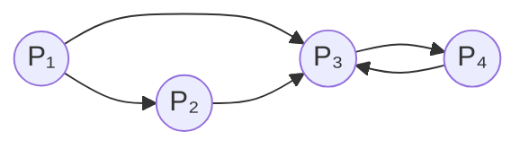

# Pagerank

## 1. Introducción

El PageRank es el algoritmo que convirtió a Google en el buscador número uno del mundo. Creado por Larry Page y Sergey Brin, su innovación fue medir la importancia de una página web no solo por su contenido, sino por la calidad y cantidad de enlaces que apuntan hacia ella.

Basado en el modelo de un navegante aleatorio, PageRank utiliza herramientas de álgebra lineal y teoría de probabilidades para asignar a cada página un valor que refleja su relevancia dentro de toda la red. Gracias a su enfoque matemático y su capacidad para ordenar de forma inteligente miles de millones de páginas, este algoritmo revolucionó la forma en que se organiza y se accede a la información en Internet.

## 2. Relacion con la cadena de Markov

Vamos a tomar de ejemplo un Internet muy básico, veamos como se conecta a la cadena de Markov, y como el algoritmo de Pagerank de Google funciona

Como puede verse en el diagrama, tenemos 4 páginas web, y las flechas indican los enlaces entre ellas. Por ejemplo, la página P1 tiene enlaces a P2 y P3, mientras que P4 solo tiene un enlace que apunta a P3. Esto parece mucho a una cadena de Markov. Si es así, ¿por qué no asignamos valores de probabilidad a las direcciones? Por ejemplo, si una pagina web tiene dos enlaces salientes, podríamos asignar a cada uno un valor de probabilidad de 0.5, si tiene tres enlaces, cada uno tendría una probabilidad de 0.33, y así sucesivamente. Si hicieramos esto, el vector estacionario de la cadena de Markov nos daría el valor de PageRank de cada página web, además de donde es mas probable que acabe un usuario.

Otro problema obvio es que este método no funciona como un navegador web. Los usuarios no solo siguen enlaces, sino que también acceden a otras páginas independientemente de dónde se encuentren.

El algoritmo Google PageRank (GP) adopta el siguiente enfoque:

1. Suponemos que un Random Websurfer (RW) empieza en una página web aleatoria.
2. Si la pagina tiene enlaces salientes, entonces hay un 85% de probabilidad de que el RW elija una de esas paginas y estas paginas igualmente. Hay un 15% de probabilidad de que el RW elija un pagina web aleatoria en Internet.
3. Si la pagina no tiene enlaces salientes, entonces el RW tiene un 100% de probabilidad de elegir una pagina web aleatoria en Internet.
4. El proceso se repite indefinidamente.

Tras leer esto, queda bastante claro que se trata exactamente de una cadena de Markov.
La imagen de arriba no representa con exactitud el movimiento de RW, ya que debemos tener en cuenta el 15 % de probabilidad de que RW elija una página al azar.
Podríamos conectar cada página con todas las demás del diagrama, pero sería un poco absurdo, así que simplemente reconocemos que las conexiones existen.

Esto se veria como dos matrices separadas, una que representa los enlaces entre las páginas web y otra que representa la probabilidad de elegir una página al azar:  
  
$$
\frac{0.15}{4}
\begin{bmatrix}
1 & 1 & 1 & 1 \\
1 & 1 & 1 & 1 \\
1 & 1 & 1 & 1 \\
1 & 1 & 1 & 1
\end{bmatrix}
{+}
0.85
\begin{bmatrix}
0 & 0 & 0 & 0 \\
0.5 & 0 & 0 & 0 \\
0.5 & 1 & 0 & 1 \\
0 & 0 & 1 & 0
\end{bmatrix}
$$

Dando como resultado la siguiente matriz de transición:  

$$
\begin{bmatrix}
0.0375 & 0.0375 & 0.0375 & 0.0375 \\
0.4625 & 0.0375 & 0.0375 & 0.0375 \\
0.4625 & 0.8875 & 0.0375 & 0.8875 \\
0.0375 & 0.0375 & 0.8875 & 0.0375
\end{bmatrix}
$$  

Esta matriz debe ser una matriz de transición, y además es regular porque la parte del teletransporte garantiza que todas sus entradas sean mayores que cero. Esto significa que desde cualquier página existe una probabilidad positiva de llegar a cualquier otra, lo cual cumple las condiciones del teorema de las cadenas de Markov regulares. Como resultado, la matriz posee un autovalor λ = 1 y un vector propio asociado que corresponde a una distribución de probabilidad estacionaria, es decir, un estado estable al que el sistema converge sin importar el punto de partida.

El vector propio asociado a λ = 1 es:  

$$
\begin{bmatrix}
0.0375 \\
0.0534 \\
0.4711 \\
0.4379
\end{bmatrix}
$$  

Ordenamos las páginas según la probabilidad de visita a largo plazo del navegante aleatorio, obteniendo los siguientes valores de PageRank: P1 = 0.0375, P2 = 0.0534, P3 = 0.4711 y P4 = 0.4379. Este resultado tiene sentido: P3 es la más importante porque recibe varios enlaces, P4 obtiene un valor alto ya que recibe un enlace desde P3, que es muy relevante, mientras que P1 es la menos importante porque nadie enlaza hacia ella. Por su parte, P2 solo mejora ligeramente al recibir un enlace de P1, que tiene poca influencia. A continuación, se analiza un segundo ejemplo donde una página no posee enlaces salientes.

## 3. Conclusión

En conclusión, el algoritmo PageRank permite medir la importancia relativa de cada página dentro de una red a partir de su estructura de enlaces. Gracias al modelo del navegante aleatorio y al uso de cadenas de Markov regulares, se obtiene una distribución estable que refleja la probabilidad de visitar cada página a largo plazo. Este enfoque matemático explica por qué páginas con muchos enlaces, o con enlaces provenientes de otras páginas relevantes, alcanzan un mayor valor de PageRank. En conjunto, este método ofrece una forma objetiva y sólida de jerarquizar información, razón por la cual se convirtió en la base del éxito de Google como principal motor de búsqueda.
